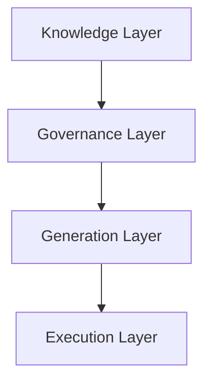

# Screenshots and Diagrams

## Overview

This document catalogs the visual assets for the demo: the **video demo**, the **Mermaid diagrams** that model the framework, and the **public-safe screenshots** of the live EmprendHEC implementation stored in [`Screenshots/`](Screenshots/).

## Video Demo

The full demo was recorded for the **Agents League Hackathon** and shows the framework operating as a live, integrated system inside Microsoft 365.

[](https://www.youtube.com/watch?v=9_NN3AMkOaw)

▶️ [Watch on YouTube: Agent-First Enterprise Architecture Builder — Agents League Hackathon](https://www.youtube.com/watch?v=9_NN3AMkOaw)

The video walks through:
- The four-layer framework (Knowledge → Governance → Generation → Execution)
- The SharePoint knowledge architecture and shared agent contract
- The live EmprendHEC agents operating inside Microsoft 365 Copilot
- The human-first governance model in practice

---

## Available Diagrams

All diagrams are stored in `examples/diagrams/` in Mermaid (`.mmd`) format.

| File | Description |
|------|-------------|
| [`architecture-layers.mmd`](../../examples/diagrams/architecture-layers.mmd) | The four-layer architectural model |
| [`knowledge-to-execution.mmd`](../../examples/diagrams/knowledge-to-execution.mmd) | How knowledge flows through to execution |
| [`public-private-boundary.mmd`](../../examples/diagrams/public-private-boundary.mmd) | The boundary between public and private content |

## Diagram Standards

All diagrams in this repository use [Mermaid](https://mermaid.js.org/) syntax:

- File format: `.mmd`
- Storage location: `examples/diagrams/`
- Naming convention: `kebab-case-descriptive-name.mmd`

Mermaid diagrams render natively in GitHub markdown and VS Code with the Mermaid extension.

## How to Add a Diagram

1. Create a `.mmd` file in `examples/diagrams/`
2. Use Mermaid syntax appropriate for the diagram type:
   - `flowchart TD` for hierarchical architecture diagrams
   - `sequenceDiagram` for process flows
   - `graph LR` for relationship diagrams
3. Add an entry to this document's table
4. Reference the diagram from the relevant documentation file

## Screenshots

Unlike a fully fictional sample, this demo includes **public-safe screenshots of the live EmprendHEC environment** so readers can confirm the pattern works in a real Microsoft 365 tenant. They are stored in [`Screenshots/`](Screenshots/) and show structure, organization, and agent behavior — never confidential operational content.

Each image was reviewed against the screenshot ground rules (see below) before inclusion.

| # | Screenshot | What it shows | Framework layer |
|---|------------|---------------|-----------------|
| 01 | `01-Screenshot Librería Principal-Arquitectura de Información.png` | SharePoint site *"EmprendHEC - Arquitectura Información"* top level: `Agentes`, `Guías por área`, `Reportes Mensuales Monitoreo M365`, and the library README | Knowledge |
| 02 | `02-Screenshot-Carpeta Agentes.png` | The `Agentes/` folder: per-agent subfolders plus the shared agent contract docs (`00`–`04`) | Governance |
| 03 | `03-Screenshot-Carpeta Guías por Área.png` | The `Guías por área/` folder: operational guides, brand/identity manuals, and `Plantillas Oficiales` | Knowledge |
| 04 | `04-Screenshot-Portada Documento README.png` | The library README that explains what does and does not belong in the knowledge base | Knowledge |
| 05 | `05-Screenshot-Manual de Identidad e Imagen.png` | The corporate identity & image manual (brand source of truth) | Knowledge |
| 06 | `06-Screenshot-Guía de Marca-Agent-Ready.png` | The *Agent-Ready* brand guide — a source of truth structured for agents, Copilot, and humans | Knowledge → Governance |
| 07 | `07-Screenshot-Guía Operativa Comercial.png` | The commercial operational guide that grounds the Commercial Agent | Knowledge |
| 08 | `08-Screenshot-Diseño de Agente Comercial.png` | The Commercial Agent design document structure (executive summary, knowledge sources, parameters, test cases) | Generation |
| 09 | `09-Screenshot-Vista Agentes en M365.png` | The Microsoft 365 Copilot Agent Store showing the published EmprendHEC agents — **living proof** that EmprendHEC runs on this ecosystem in daily operation, not a staged demo | Generation |
| 10 | `10-Screenshot-Vista Agente Comercial.png` | The Commercial Agent answering a real query inside M365 Copilot chat | Execution |

> Screenshot 08's design document deliberately stops at the **Prompt de Instrucciones** boundary: the structure is public, the prompt content is private.

> **Why the Navigation Pane is shown.** The document screenshots (04–08) are captured with the Word **Navigation Pane** open on the left, exposing each document's full heading outline. This is intentional: it shows these are **complete, structured, real documents** from a working implementation — not slides, summaries, or mockups — while the body text stays at a non-confidential zoom level.

### Screenshot ground rules (read before adding images)

All screenshots must be **public-safe**. Before adding an image, confirm it does **not** reveal:

- real client, customer, or personnel names or PII
- confidential business rules, pricing, or internal decision logic
- private prompts, knowledge-base contents, or system instructions
- secrets, credentials, tenant IDs, endpoints, or connector configuration

If an image would expose any of the above, **redact, blur, or recreate it with placeholder data** before adding it. If you are adapting this framework, keep your own implementation screenshots in your private repository or internal documentation.

## Embedding Diagrams in Documents

To reference a diagram in a documentation file:

```markdown
See the [architecture layers diagram](../../examples/diagrams/architecture-layers.mmd) for a visual representation.
```

Or embed using a Mermaid code block directly in a markdown file for inline rendering:

````markdown

````
