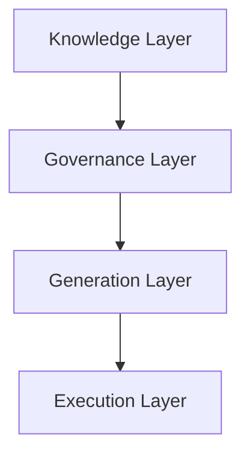

# Screenshots and Diagrams

## Overview

This document catalogs the visual assets available for this framework and provides guidance on contributing new diagrams.

## Available Diagrams

All diagrams are stored in `examples/diagrams/` in Mermaid (`.mmd`) format.

| File | Description |
|------|-------------|
| [`architecture-layers.mmd`](../../examples/diagrams/architecture-layers.mmd) | The four-layer architectural model |
| [`knowledge-to-execution.mmd`](../../examples/diagrams/knowledge-to-execution.mmd) | How knowledge flows through to execution |
| [`public-private-boundary.mmd`](../../examples/diagrams/public-private-boundary.mmd) | The boundary between public and private content |

## Diagram Standards

All diagrams in this repository use [Mermaid](https://mermaid.js.org/) syntax:

- File format: `.mmd`
- Storage location: `examples/diagrams/`
- Naming convention: `kebab-case-descriptive-name.mmd`

Mermaid diagrams render natively in GitHub markdown and VS Code with the Mermaid extension.

## How to Add a Diagram

1. Create a `.mmd` file in `examples/diagrams/`
2. Use Mermaid syntax appropriate for the diagram type:
   - `flowchart TD` for hierarchical architecture diagrams
   - `sequenceDiagram` for process flows
   - `graph LR` for relationship diagrams
3. Add an entry to this document's table
4. Reference the diagram from the relevant documentation file

## Screenshots

Screenshots of live implementations are intentionally excluded from this public repository, as they may reveal private system configurations, organizational data, or internal tooling.

If you are adapting this framework and wish to document your implementation, screenshots should be stored in your private repository or internal documentation system.

## Embedding Diagrams in Documents

To reference a diagram in a documentation file:

```markdown
See the [architecture layers diagram](../../examples/diagrams/architecture-layers.mmd) for a visual representation.
```

Or embed using a Mermaid code block directly in a markdown file for inline rendering:

````markdown

````
